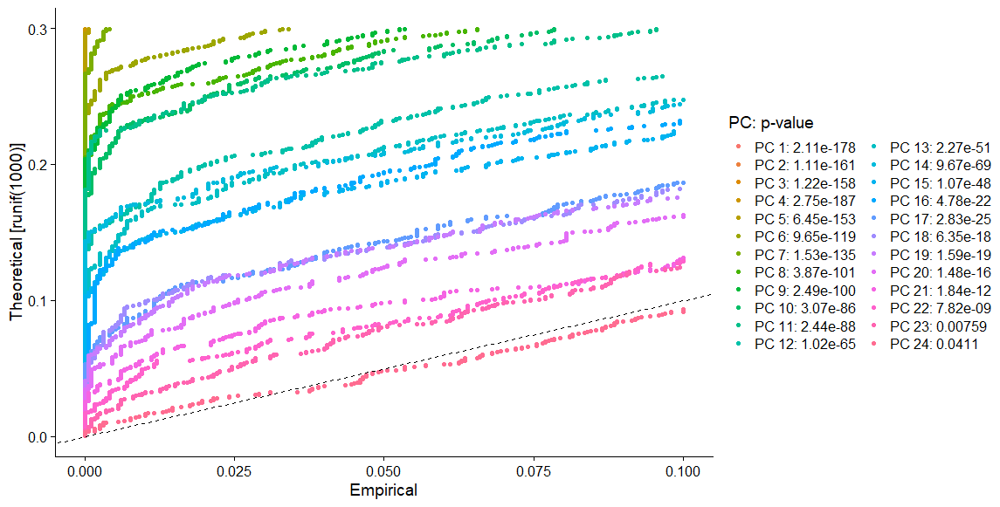
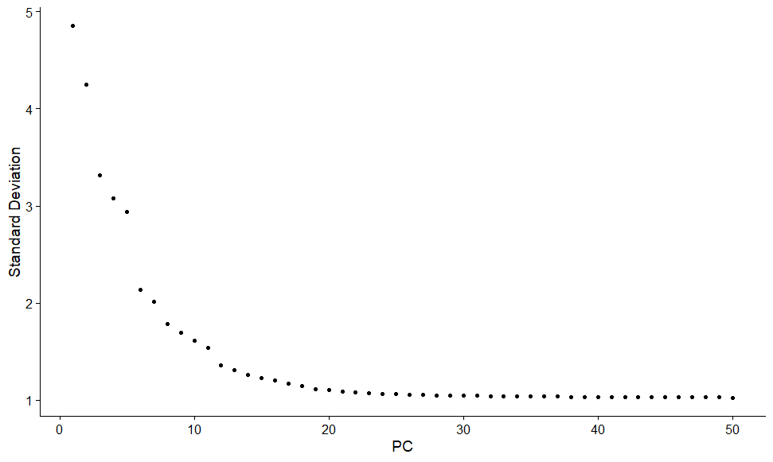

```{r, include = FALSE}
knitr::opts_chunk$set(
  collapse = TRUE,
  comment = "#>",
  warning = FALSE,
  message = FALSE
)
```

# Introduction

SSD is a simulator that generate different sample size data from pilot data based on multivariate guassian distribution. Then it will calculate the corresponding classification error/ARI/AMI and draw the plot which has the same trend as the true data. People can determine the sample size according the plot we draw.


# Preparations
Before we dive into the main task, we need to load the package and an example dataset for our task. The dataset we use is the **pmbc_68k** dataset from [10x Genomics](https://www.10xgenomics.com/resources/datasets/fresh-68-k-pbm-cs-donor-a-1-standard-1-1-0).
```{r setup and load data}
library(SSD)

# load data -----------------------------------------------------------------------------
data_pmbc <- read.csv(system.file("extdata", "data_pmbc_24pc.csv", package = "SSD"),row.names=1)
data = data_pmbc
```
We pre-processed the dataset: we normalize and scale the date at first and then run principal component analysis (PCA) and keep 24 PCs according to *JackStrawPlot* and *ElbowPlot* mentioned in [Seurat - Guided Clustering Tutorial](https://satijalab.org/seurat/articles/pbmc3k_tutorial.html). The *JackStrawPlot* and *ElbowPlot* are shown below:
```{r echo=FALSE, fig.cap="JackStrawPlot", out.width = '100%'}

```
```{r echo=FALSE, fig.cap="ElbowPlot", out.width = '100%'}

```


# With pilot data, draw the plot and determine sample size using the built-in model


# With pilot data, draw the plot and determine sample size using the self-defined model


# With pilot data and large true data, draw the plot and compare the result
